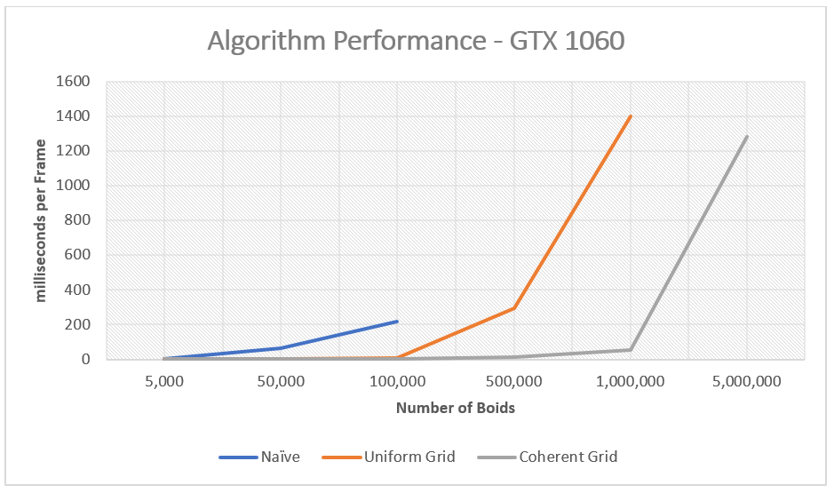
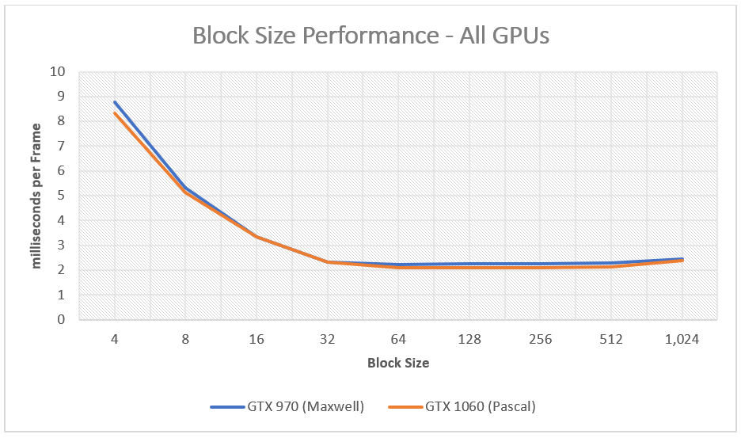
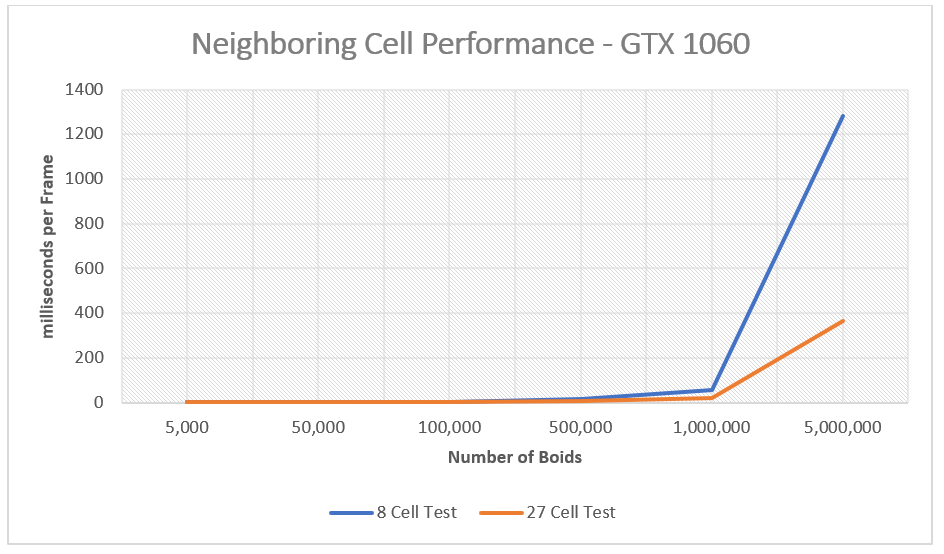
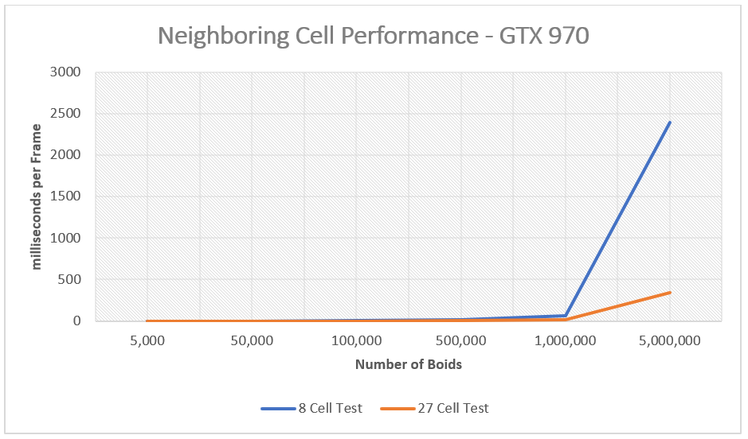
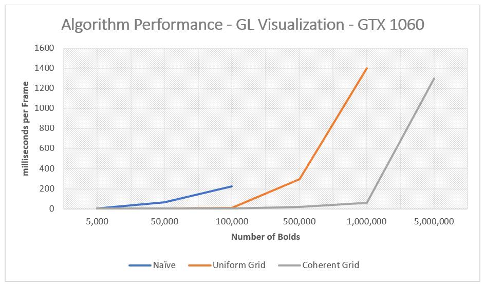
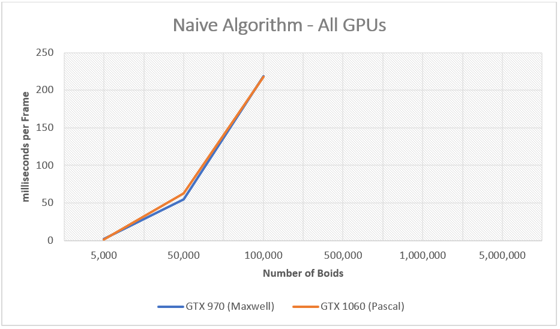
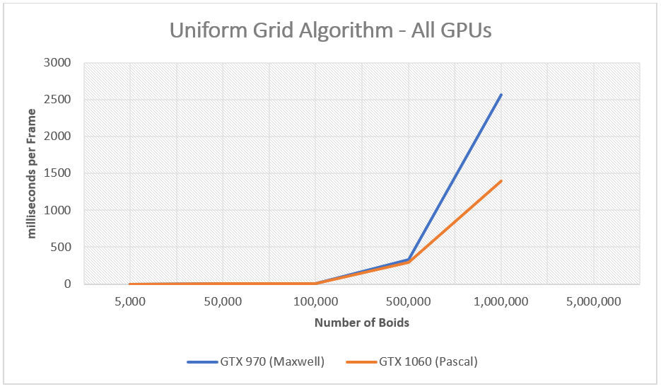
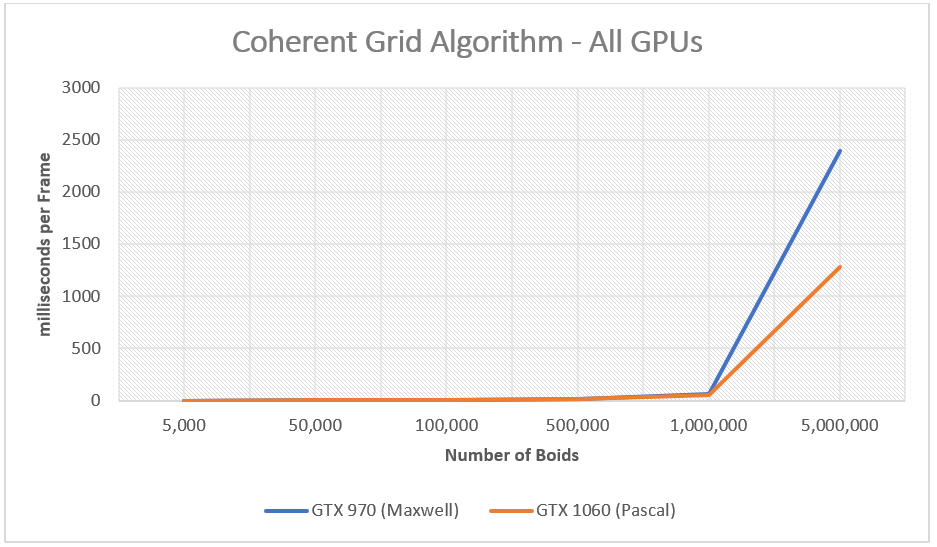

**University of Pennsylvania, CIS 565: GPU Programming and Architecture,
Project 1 - Flocking**

* Vasu Mahesh
  * [LinkedIn](http://linkedin.com/in/vasumahesh)
  * [Code Blog](http://www.codeplaysleep.com)

* Tested on a Laptop:
  * Windows 10
  * i7-8650U @ 1.90GHz
  * 16GB RAM
  * GTX 1060 6GB
  * Visual Studio 2017 (with v140 toolset)
  * CUDA v8.0

* Tested on a Desktop:
  * Windows 10
  * i7-4790K @ 4.0GHz
  * 16GB RAM
  * GTX 970 4GB
  * Visual Studio 2017 (with v140 toolset)
  * CUDA v8.0


## Build

Build Command: `cmake -G "Visual Studio 15 2017 Win64" -DCUDA_TOOLKIT_ROOT_DIR="C:\Program Files\NVIDIA GPU Computing Toolkit\CUDA\v8.0" -T v140,cuda=8.0 ..`

I tested my code on both systems. I made some tiny scripts that computes the average milliseconds per frame (in main.cpp). The program runs for about 30s and stops. It reports that metric in the console.

**Notes:** I made my graphs correspond to Milliseconds per Frame. It is the same as 1.0 / FPS, so I guess it should be fine.

## Results

Results generally compare the time per frame in milliseconds. I compared results from GTX 970 and from GTX 1060.

| Statistic               | GTX 970           | GTX 1060          |
| ----------------------- |:-----------------:|:-----------------:|
| Architecture            | Maxwell           | Pascal            |
| Core Speed              | 1050 - 1178 MHz   | 1404 - 1670 Mhz   |
| Memory Speed            | 3500 Mhz          | 8000 MHz          |
| Memory Bus Width        | 256-bit           | 192-bit           |
| Max. Amount of Memory   | 4096MB            | 6144 MB           |
| CUDA Cores              | 1664              | 1280              |

The GTX 970 does have more CUDA cores, but the clock speed is really low. I expected 970 to win, but it turned out the 1060 was faster. A point to note, my 970 was running an older driver, which also could play a role. But, I suspect having a slow core speed, the architecture and memory speed could have played a bigger role.

---

### Performance of Algorithm

`For each implementation, how does changing the number of boids affect performance? Why do you think this is?`

As we increase the number of boids, there is a general trend of increase in frame processing time. The Naive Algorithm ended up crashing for 500,000 boids and above.




| Boid Count  | Naive                              | Uniform Grid                          | Coherent Grid   |
| ----------- |------------------------------------|-------------------------------------- |-----------------|
| 5,000       | 1.73356                            | 1.69154                               | 1.79578         |
| 50,000      | 63.0121                            | 3.09724                               | 2.10838         |
| 100,000     | 217.913                            | 8.21635                               | 2.12726         |
| 500,000     | Unspecified Launch Failure         | 293.805                               | 15.647          |
| 1,000,000   | Unspecified Launch Failure         | 1399.34                               | 54.7602         |
| 5,000,000   | Unspecified Launch Failure         | Unspecified Launch Failure            | 1282.11         |


`For the coherent uniform grid: did you experience any performance improvements with the more coherent uniform grid? Was this the outcome you expected? Why or why not?`

For coherent uniform grid, there was a tremendous performance increase. Compared to Uniform Grid, there is 1 less indirection which allows us to use the same indices obtained from GridStart and GridEnd vectors directly as memory accessors. So, there is less "jumping" across memory.


---

### Block Size

`For each implementation, how does changing the block count and block size
affect performance? Why do you think this is?`

If we change the block size we see performance issues for sizes less than 32. This might be because there are too few boids per block and we aren't using the GPU fully. There is an unexplained bump at the end of 1024 block size, which was observed in both Maxwell and Pascal.




| Block Size  | GTX 970      | GTX 1060        |
| ----------- | ------------ | --------------- |
| 4           | 8.75682      | 8.32634         |
| 8           | 5.3235       | 5.14231         |
| 16          | 3.34341      | 3.33034         |
| 32          | 2.33586      | 2.3088          |
| 64          | 2.2251       | 2.10187         |
| 128         | 2.25017      | 2.10287         |
| 256         | 2.25511      | 2.10359         |
| 512         | 2.27528      | 2.1192          |
| 1024        | 2.44437      | 2.40032         |


---

### Cell Neighbor Test

`Did changing cell width and checking 27 vs 8 neighboring cells affect performance?
Why or why not?`



| Boid Count  | 8 cell test   | 27 cell test  |
| ----------- | ------------- | ------------- |
| 5,000       | 1.79578       | 1.7994        |
| 50,000      | 2.10838       | 1.99957       |
| 100,000     | 2.12726       | 1.45459       |
| 500,000     | 15.647        | 7.48839       |
| 1,000,000   | 54.7602       | 21.0801       |
| 5,000,000   | 1282.11       | 366.668       |


When we change the neighborhood from 8 cells to 27 cells, there was no difference till 500,000 boids. When we passed that mark, We can see from the graph that 27 neighbouring cells is much faster. This could be because:

```cpp
// 8 Neighbor Cell Test
// ------------------------------
int CellWidth = 2.0f * SearchRadius;

// 8 cells in a 2x2x2 fashion would result:
int TotalSquareSide = 2.0f * CellWidth; // Which Equals to 4 x Search Radius


// 27 Neighbor Cell Test
// ------------------------------
int CellWidth = 1.0f * SearchRadius;

// 27 cells in a 3x3x3 fashion would result:
int TotalSquareSide = 3.0f * CellWidth; // Which Equals to 3 x Search Radius
```

`TotalSquareSide` is shorter in the 27 neighborhood compared to the 8 cell neighborhood. Another way to look at this: Our search box is way bigger in 8 cell test compared to 27 cell test. Thus, when the number of boids increase, there is an increase in the number of boids in each `TotalSquareSide` Cube. Thus, causing more checks, more iterations etc. in the 8 cell test.



| Boid Count  | 8 cell test   | 27 cell test  |
| ----------- | ------------- | ------------- |
| 5,000       | 1.26449       | 1.14823       |
| 50,000      | 1.45266       | 1.17393       |
| 100,000     | 2.27812       | 1.62882       |
| 500,000     | 16.778        | 7.63463       |
| 1,000,000   | 59.6526       | 20.5757       |
| 5,000,000   | 2395.84       | 345.515       |

A suprising thing to see here, GTX 970 **performed better** than GTX 1060 when using 27 neighboring cell test. This might be because of the higher core count and lesser checks per block? -- I ran this test more than two times, but the results were similar.

---

### Algorithms with Visualization On



---

### Some GPU vs GPU Graphs





